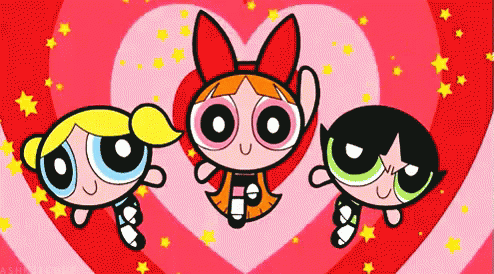

<br>
<u>

<center>



# Memory Game 

</u>

<u>

## Goal: 

</u>
</center>

### Our goal for this assignment was to build a memory game with React. I broke up the application UI into components, managed component state, and responded to user events.

<br>


<br>


## Criteria:

Within this project, I included:

<center>

```
1. Responsive game page
2. Linkedin, Github and Email
3. Aesthetic web layout
4. View and Update features

 ```

</center>


<br>

<u>


## Technologies Used:

- Visual Studio Code
- Gitlab
- Terminal
- Github

<br>

## Table of Contents:
1. Goal
2. Criteria
3. Issues
4. Technologies Used
5. Table of Contents
6. Links
7. Deployed Link


<br>

## Links:

- [Link to Github](https://github.com/kellystone4/memoryGame)
- [Link to LinkedIn](https://www.linkedin.com/in/kelly-a-stone/)

<br>

## Deployed Link:
- [Link to Memory Game](https://kellystone4.github.io/memoryGamePowerPuff/)
